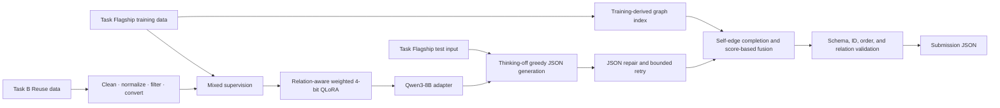

# BigDipperAI for LLMs4OL 2026 Task Flagship

[](https://github.com/Qiaoyu1332/BigDipperAI-LLMs4OL-2026/actions/workflows/unit-tests.yml)
[](LICENSE)

BigDipperAI is a reproducible system for structured ontology generation in the [LLMs4OL 2026 Task Flagship](https://sites.google.com/view/llms4ol2026/flagship-task). It maps a test item containing an `id` and natural-language `context` to a JSON list of `primitive-ontology-triples`, with each triple represented as `[subject, relation, object]`.

This repository contains the training, inference, post-processing, and validation programs used by the submitted system. It does not contain challenge data, model weights, trained adapters, prediction files, organizer reference answers, or evaluation results.

## System overview



The pipeline has five connected parts:

1. **Data harmonization.** Task B Reuse triples are cleaned, deduplicated, normalized, filtered to the 28-relation Task Flagship vocabulary, and serialized in the Task Flagship target schema.
2. **Weighted QLoRA training.** Qwen3-8B is adapted over a frozen 4-bit `nf4` base model. Training examples receive relation-aware weights derived from their target triples.
3. **Structured generation.** The model receives the item identifier, context, allowed relations, instructions, and expected JSON schema. Qwen3 thinking is disabled and decoding uses `do_sample=false` with one beam.
4. **Repair and graph-aware post-processing.** The parser recovers admissible triples from structured text, performs a bounded retry when required, and combines model candidates with context-gated self-edge candidates derived from training data.
5. **Submission validation.** The final payload is checked for schema, identifier coverage and order, duplicate identifiers, triple shape, string types, and relation-vocabulary membership.

These stages enforce a reproducible data and submission contract. Structural validation does not determine whether a predicted ontology edge is semantically correct.

## Training configuration

| Component | Setting |
|---|---|
| Base model | `Qwen/Qwen3-8B` |
| Quantization | 4-bit `nf4` with double quantization |
| LoRA `r` / `lora_alpha` / dropout | 32 / 64 / 0.05 |
| LoRA target modules | `q_proj`, `k_proj`, `v_proj`, `o_proj`, `gate_proj`, `up_proj`, `down_proj` |
| Epochs | 3 |
| Learning rate | `2e-4` |
| Per-device batch / gradient accumulation | 1 / 8 |
| Warm-up ratio / maximum gradient norm | 0.03 / 0.3 |
| Seed / data seed | 42 / 42 |
| Input / initial output token limits | 3,072 / 1,536 |
| Relation weights | `instance-of`: 3; `type`: 3; default: 1; sample maximum: 3 |

The code selects `bfloat16` computation when the active CUDA device reports support and otherwise selects `float16`.

## Requirements and installation

- Linux
- Python 3.11
- A CUDA-capable NVIDIA GPU suitable for Qwen3-8B 4-bit fine-tuning
- Access to `Qwen/Qwen3-8B`, or a complete local cache

Create an isolated environment and install the pinned direct dependencies:

```bash
python -m venv .venv
source .venv/bin/activate
python -m pip install --upgrade pip
python -m pip install -r requirements.txt
```

The recorded submission environment is documented in [docs/reproducibility.md](docs/reproducibility.md).

## Data contracts

Obtain the data under the terms of the official challenge. The commands expect:

- Task Flagship training JSON with `id`, `context`, and `primitive-ontology-triples`.
- Task B Reuse training JSON with `id`, `context`, `initial-primitive-ontology-triples`, and `extended-primitive-ontology-triples`.
- Task Flagship test JSON with `id` and `context`.

Fictional schema examples are provided in [`examples/`](examples/). They illustrate fields only and are not challenge records.

## Run the complete pipeline

Use a work directory outside the source checkout. The `run` command prepares the mixed training records, trains the adapter, builds graph statistics, predicts the test items, and validates the submission payload.

```bash
python main.py run \
  --task-a-train /data/train_task_a.json \
  --task-b-train /data/train_task_b.json \
  --test /data/test_task_a_input.json \
  --work-dir /runs/bigdipperai
```

Add `--local-files-only` when the complete base model is already cached and network access should be disabled.

## Train and predict separately

Train the adapter:

```bash
python main.py train \
  --task-a-train /data/train_task_a.json \
  --task-b-train /data/train_task_b.json \
  --work-dir /runs/bigdipperai
```

Predict with an existing adapter:

```bash
python main.py predict \
  --task-a-train /data/train_task_a.json \
  --test /data/test_task_a_input.json \
  --adapter-dir /runs/bigdipperai/adapter \
  --work-dir /runs/bigdipperai-predict
```

`--max-train-samples`, `--max-eval-samples`, `--max-steps`, and `--max-items` are smoke-test controls. Omit them for the complete workflow.

## Runtime outputs

The selected work directory may contain:

- `adapter/`: trained LoRA adapter and tokenizer files.
- `task_a_predictions.json`: ordered submission payload.
- `inference_log.json`: generation, parsing, retry, and fusion diagnostics.
- `validation.json`: schema, ID, order, and relation validation report.
- `training_summary.json` and `run_summary.json`: data and execution summaries.

Each prediction item has this structure:

```json
{
  "id": "fictional-test-001",
  "primitive-ontology-triples": [
    ["Comet", "is-a", "Celestial object"]
  ]
}
```

Runtime outputs are ignored by Git and should be stored outside this repository.

## Tests

Run the seven CPU-oriented unit tests from the repository root:

```bash
python unittest.py
```

The tests cover prompt construction, Task B conversion, relation-aware sample weighting, JSON parsing, graph completion, candidate fusion, data preparation, and final payload validation. GitHub Actions runs the same command with Python 3.11.

## Repository contents

- `main.py`: command-line entry point for `run`, `train`, and `predict`.
- `data_pipeline.py`: Task Flagship/Task B conversion, mixed training records, and graph-index construction.
- `model_pipeline.py`: weighted QLoRA training, adapter loading, greedy generation, bounded retry, and inference logging.
- `ontology_pipeline.py`: prompt, relation vocabulary, parsing, entity checks, graph completion, fusion, and submission validation.
- `unittest.py`: unit tests that do not download a base model.
- `requirements.txt`: pinned direct Python dependencies.
- `docs/reproducibility.md`: environment, run-boundary, version, and artifact provenance.
- `examples/`: fictional JSON schema examples.

## Data, models, and evaluation

- Challenge information: [LLMs4OL 2026 Task Flagship](https://sites.google.com/view/llms4ol2026/flagship-task)
- Submission format: [LLMs4OL 2026 Submission](https://sites.google.com/view/llms4ol2026/submission)
- Released evaluator: [LLMs4OL Challenge 2026 metrics](https://github.com/sciknoworg/LLMs4OL-Challenge/tree/main/2026/metrics)
- Base model: [Qwen/Qwen3-8B](https://huggingface.co/Qwen/Qwen3-8B)

Users must obtain the challenge data and base model from their official sources and comply with the corresponding licenses and access terms. The organizers hold the reference outputs required to compute the official results. The accompanying system paper is being prepared; organizer-released results are pending.

## License

The source code in this repository is released under the [MIT License](LICENSE). Third-party data and model licenses remain with their respective owners.
